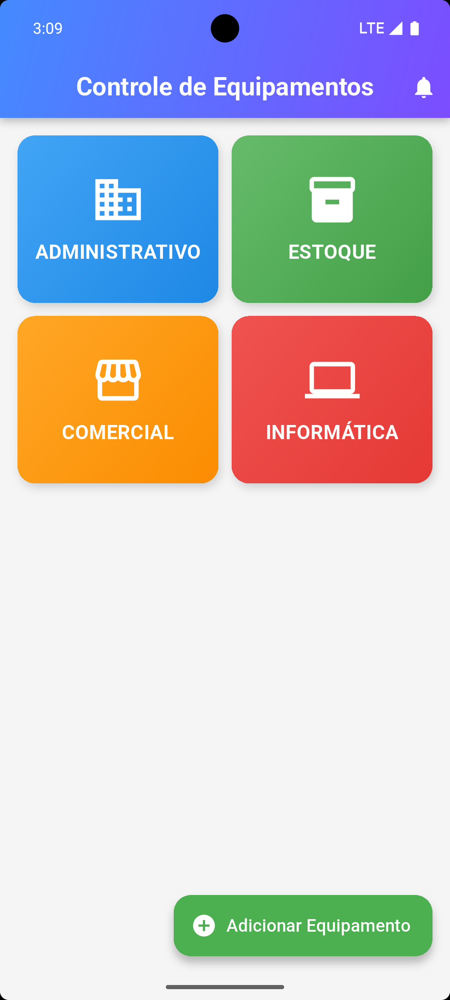
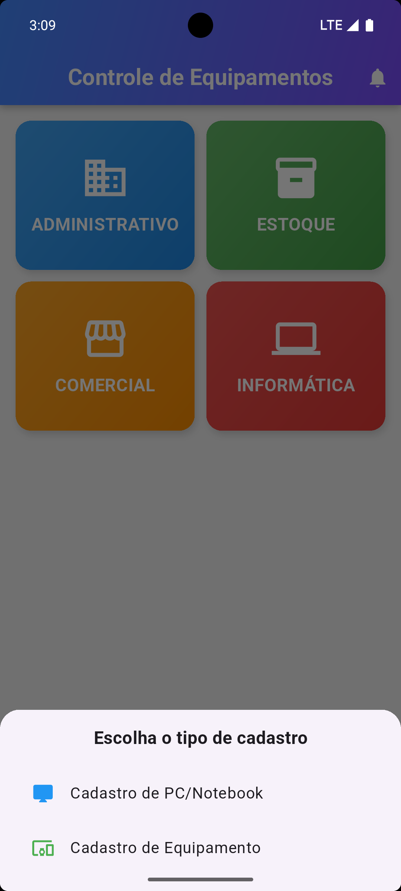
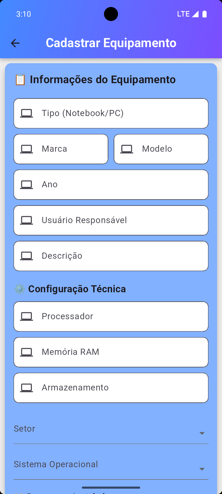
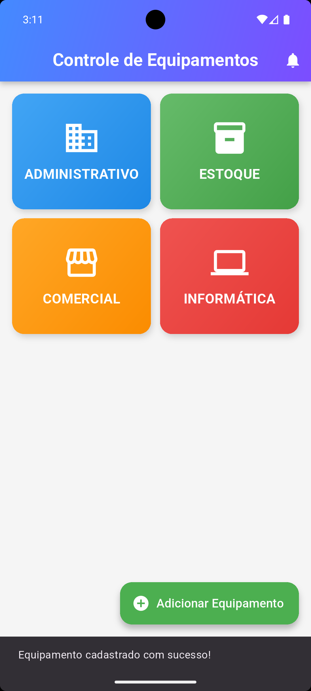

# 📌 Controle de Equipamentos

Aplicação desenvolvida em **Flutter** para cadastro e gerenciamento de equipamentos por setores da empresa.  
O backend foi desenvolvido em **PHP** e o banco de dados é **MySQL** (XAMPP).

---

## 🖼️ Imagens do Aplicativo

### Tela Inicial  

### Modal de Cadastro  

### Formulário de Cadastro  

### Programas Instalados  

### Cadastro Concluído  

### Equipamentos por Setor  

### Detalhes do Equipamento  

---

## 🔧 Tecnologias Utilizadas

- **Flutter** (Front-end)  
- **Dart**  
- **PHP** (Back-end)  
- **MySQL** (Banco de Dados)  
- **XAMPP** (Ambiente Local)  
- **http** (Consumo de API)  
- **Provider** (Gerenciamento de estado)  

---
